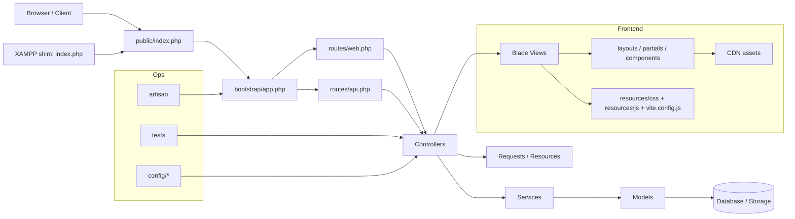

# 01. Project Discovery - smartwater-admin

Scope: repository structure only. No business logic analysis.

## 1) Detected Programming Languages

- PHP: Laravel application code, controllers, models, requests, services, migrations, seeders, bootstrap files, CLI entry points.
- Blade / HTML: server-rendered views under `resources/views`.
- JavaScript: Vite entry and browser assets under `resources/js` and `public/js`.
- CSS: frontend styles under `resources/css` and `public/css`.
- JSON: `composer.json`, `package.json`, `composer.lock`, test/config metadata.
- XML: `phpunit.xml`.
- Markdown: project docs and directory READMEs.
- Shell / batch / PowerShell: local startup and setup scripts.

## 2) Detected Frameworks

- Laravel: backend framework.
- Blade: templating layer used by the view files.
- Vite: frontend asset bundler.
- Tailwind CSS: present in the frontend toolchain.
- PHPUnit: test framework.

## 3) Architecture Style

- Laravel MVC structure.
- Web layer split from API layer.
- Service layer present between controllers and data-facing classes.
- Separate request validation and resource serialization layers.
- Server-rendered Blade UI with a JSON API surface.
- Modular monolith organized by feature area.

## 4) Project Entry Points

- HTTP front controller: `public/index.php`.
- XAMPP shim: `index.php`.
- CLI entry point: `artisan`.
- Laravel bootstrap: `bootstrap/app.php`.
- Web routes: `routes/web.php`.
- API routes: `routes/api.php`.
- Console routes: `routes/console.php`.
- Frontend build entry: `vite.config.js`.
- Frontend asset entry files: `resources/css/app.css`, `resources/js/app.js`.

## 5) Important Directories

| Directory | Role |
|---|---|
| `app/` | Application code root. |
| `app/Http/Controllers/` | HTTP controllers for web and API endpoints. |
| `app/Http/Requests/` | Form request classes for request validation. |
| `app/Http/Resources/` | API resource classes for JSON shaping. |
| `app/Models/` | Eloquent model classes. |
| `app/Services/` | Service classes grouped by feature. |
| `app/Support/` | Shared support code such as `MockData.php`. |
| `bootstrap/` | Laravel bootstrap and provider registration. |
| `config/` | Framework and service configuration. |
| `database/migrations/` | Schema migration files. |
| `database/seeders/` | Database seeder classes. |
| `database/factories/` | Model factory classes. |
| `public/` | Web root and publicly served assets. |
| `resources/views/` | Blade templates and reusable view fragments. |
| `resources/css/` | Source CSS assets. |
| `resources/js/` | Source JavaScript assets. |
| `routes/` | Web, API, and console route definitions. |
| `storage/` | Runtime storage for logs, cache, sessions, and app files. |
| `tests/` | Unit and feature tests. |
| `QLDA/Form_report/` | Output/report workspace outside the app itself. |

## 6) Functional Modules

| Module | Evidence in structure |
|---|---|
| Authentication | `app/Http/Controllers/AuthController.php`, `resources/views/auth/`, `/login` routes. |
| Dashboard | `DashboardController`, `DashboardService`, `resources/views/dashboard/`, root `/` route. |
| Products | `ProductController`, `ProductService`, `ProductRequest` classes, product views, product resource class. |
| Categories | `CategoryController`, `CategoryService`, category request classes, category views, category resource class. |
| Inventory | `InventoryController`, `InventoryService`, inventory request classes, inventory views, inventory resource class. |
| Batches | `BatchController`, `BatchService`, batch request classes, batch views, batch-related models and migrations. |
| Customers | `CustomerController`, `CustomerService`, customer request classes, customer views. |
| Contracts | `ContractController`, `ContractService`, contract request classes, contract views, contract-related models and migrations. |
| Devices | `DeviceController`, `DeviceService`, device request classes, device views, device-related migrations and dashboard data model. |
| MCU | `McuController`, `McuService`, `Mcu` model, MCU migration and request classes. |
| Employees | `EmployeeController`, `EmployeeService`, employee request classes, employee views. |
| Activities | `ActivityController`, activity log model, activity views, activity log migration and seeder. |
| Profile | `ProfileController`, profile request classes, profile views. |
| Telemetry API | `TelemetryController`, `/api/telemetry` route. |
| Shared UI | `resources/views/layouts`, `partials`, `components`. |
| Data scaffolding | `app/Support/MockData.php`, database seeders, factories, migrations. |
| Tests | `tests/Unit` and `tests/Feature`. |

## 7) Configuration Files

| File | Purpose |
|---|---|
| `composer.json` | PHP dependencies, scripts, autoload rules. |
| `composer.lock` | Locked PHP dependency versions. |
| `package.json` | Node dependencies and frontend scripts. |
| `vite.config.js` | Vite build configuration. |
| `phpunit.xml` | Test runner configuration. |
| `bootstrap/app.php` | Laravel application bootstrap and route registration. |
| `bootstrap/providers.php` | Application service provider registration. |
| `config/app.php` | Core app configuration. |
| `config/auth.php` | Authentication configuration. |
| `config/cache.php` | Cache configuration. |
| `config/database.php` | Database connection configuration. |
| `config/filesystems.php` | Filesystem disks configuration. |
| `config/logging.php` | Logging configuration. |
| `config/mail.php` | Mail configuration. |
| `config/queue.php` | Queue configuration. |
| `config/services.php` | Third-party service credentials. |
| `config/session.php` | Session configuration. |
| `routes/web.php` | Web route table. |
| `routes/api.php` | API route table. |
| `routes/console.php` | Artisan command route table. |
| `DATABASE_SCHEMA.md` | Schema documentation. |
| `BACKEND_SETUP.md` | Backend setup documentation. |
| `API_SPECIFICATION.md` | API documentation. |

## 8) Build Tools

- Composer: PHP dependency manager and script runner.
- NPM: frontend dependency manager.
- Vite: frontend build and dev server.
- Laravel Vite plugin: asset integration with Laravel.
- Tailwind CSS Vite plugin: Tailwind build integration.
- Concurrent process runner: used by the `composer dev` script.
- PHPUnit: test execution.
- Laravel Artisan: application and maintenance command runner.

## 9) External Services

Configured or referenced in the repository structure:

- Google Fonts CDN.
- Bootstrap CDN.
- Bootstrap Icons CDN.
- jQuery CDN.
- DataTables CDN.
- ApexCharts CDN.
- Postmark.
- Resend.
- AWS SES.
- Slack notifications.
- AWS S3-compatible storage.
- SQLite.
- MySQL / MariaDB.
- PostgreSQL.
- SQL Server.
- Redis.
- Beanstalkd.
- Amazon SQS.

## 10) High-Level Architecture

